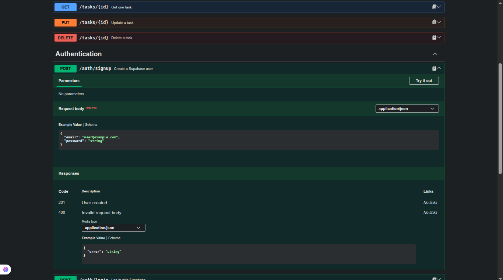
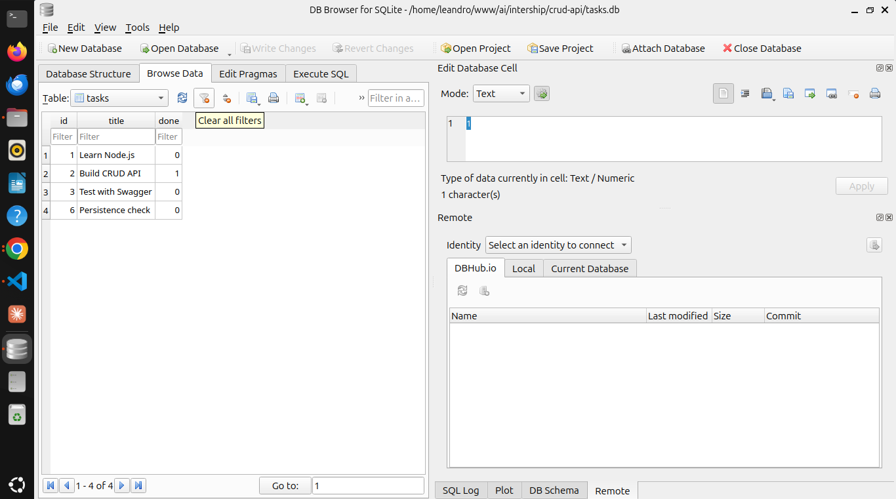
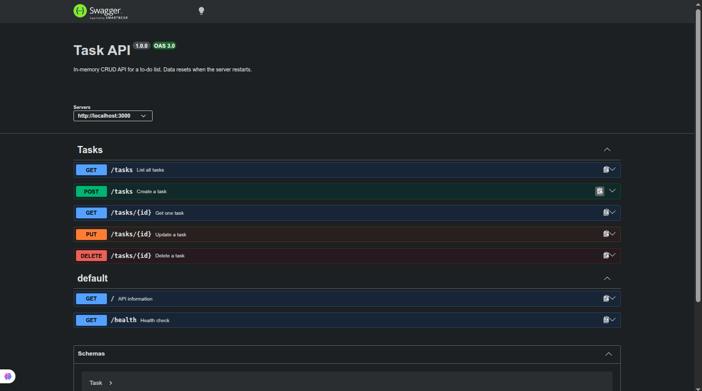

# Task API

A secured to-do list CRUD API built with Node.js, Express, SQLite, Supabase Auth, and Swagger UI. Tasks are stored in `tasks.db` and survive server restarts.

## Run

```bash
npm install
npm start
```

After cloning the repository, run `npm install` once and use `npm start` to launch the API at `http://localhost:3000`. The SQLite database is created automatically on startup.

## Authentication setup

Copy `.env.example` to `.env` and fill in the Supabase project URL and **anon** key:

```bash
cp .env.example .env
```

Never use a `service_role` key and never commit `.env`. The server sends credentials only to Supabase Auth and never stores passwords locally.

## Database

SQLite was chosen because it is a single-file database with zero setup, while still providing reliable persistence between restarts. The `tasks.db` file and its `tasks` table are created automatically when the server starts. The database file is ignored by Git.

Example SQL query:

```sql
SELECT * FROM tasks WHERE done = 1;
```

The seed inserts three example tasks only when the database is empty. Restarting the server does not duplicate them. Every database operation uses parameterized SQL queries (`?`).

## Endpoints

| Method | Path | Description |
| --- | --- | --- |
| GET | `/` | API metadata |
| GET | `/health` | Health check |
| GET | `/tasks` | List all tasks |
| GET | `/tasks/:id` | Get one task |
| POST | `/tasks` | Create a task |
| PUT | `/tasks/:id` | Update a task |
| DELETE | `/tasks/:id` | Delete a task |
| GET | `/docs` | Interactive Swagger UI |
| POST | `/auth/signup` | Create a Supabase user; no auth required |
| POST | `/auth/login` | Log in and receive tokens; no auth required |
| POST | `/auth/logout` | Log out; Bearer token required |
| GET | `/public/info` | Public information; no auth required |
| GET | `/protected/profile` | User profile; Bearer token required |

Protected routes require this header:

```text
Authorization: Bearer <access_token>
```

## CRUD validation

Create a task with `201 Created`:

```bash
curl -i -X POST http://localhost:3000/tasks \
  -H "Content-Type: application/json" \
  -d '{"title":"Buy milk"}'
```

```text
HTTP/1.1 201 Created
Content-Type: application/json; charset=utf-8

{"id":4,"title":"Buy milk","done":false}
```

Update the task with `200 OK` and delete it with `204 No Content`:

```bash
curl -i -X PUT http://localhost:3000/tasks/4 \
  -H "Content-Type: application/json" \
  -d '{"done":true}'

curl -i -X DELETE http://localhost:3000/tasks/4
```

To verify persistence, create a task, stop the server, run `npm start` again, and call `GET /tasks`. The task remains available because it is stored in `tasks.db`.

Invalid input returns `400 Bad Request`:

```text
{"error":"Title is required and must be a non-empty string"}
```

Open `http://localhost:3000/docs` to explore and execute every operation through Swagger UI.

## Auth Swagger screenshot



## DB Browser screenshot

Open `tasks.db` with DB Browser for SQLite after running the CRUD tests and insert the screenshot below:



## Swagger screenshot

